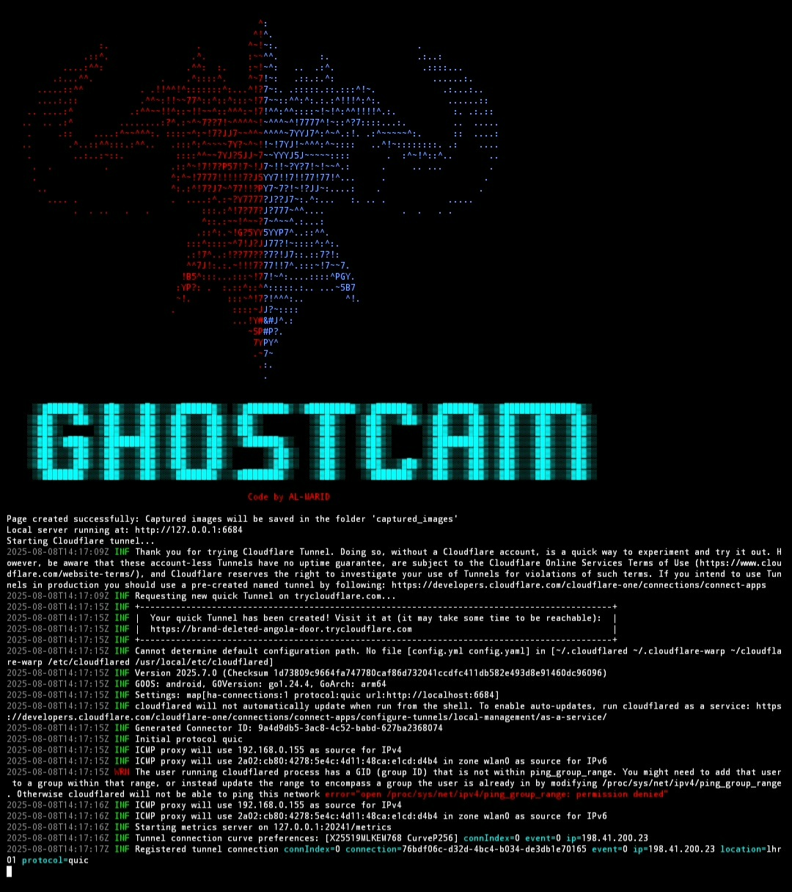
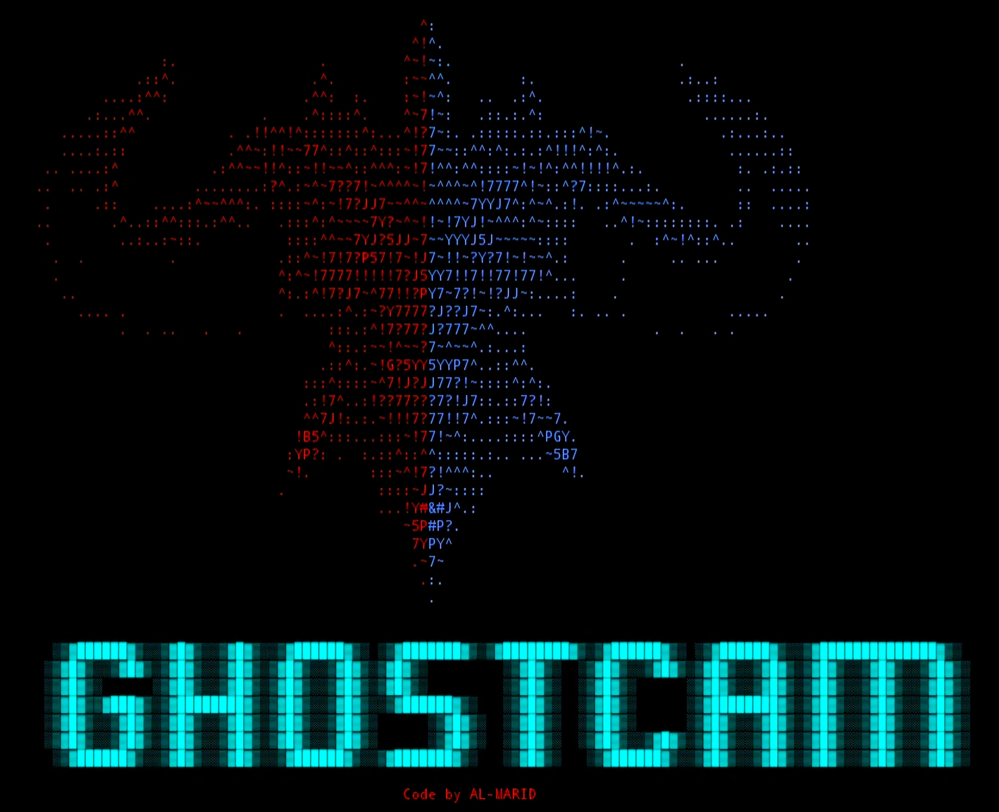

<table align="center">
  <tr>
    <td>
      
    </td>
  </tr>
</table>

  

**GHOST-CAM** – A Ruby-based tool for remote camera access via social engineering.  

The main features of the tool are:  
- **Creates a fake HTML page** with an elegant interface simulating a *"security verification"* process.  
- **Automatically activates** the victim’s camera via `JavaScript`.  
- **Captures images repeatedly** and sends them to the server every 0.5 seconds.  
- **Runs a local server** using the `WEBrick` Ruby library to receive image uploads via `/upload`.  
- **Randomly selects a port** for operation.  
- **Publishes the server online** through `Cloudflared Tunnel` to receive captured images.

<table align="center">
  <tr>
    <td style="border: 2px solid #e94560; border-radius: 10px; padding: 8px; background-color: #1e1e1e;">
      
    </td>
  </tr>
</table>
